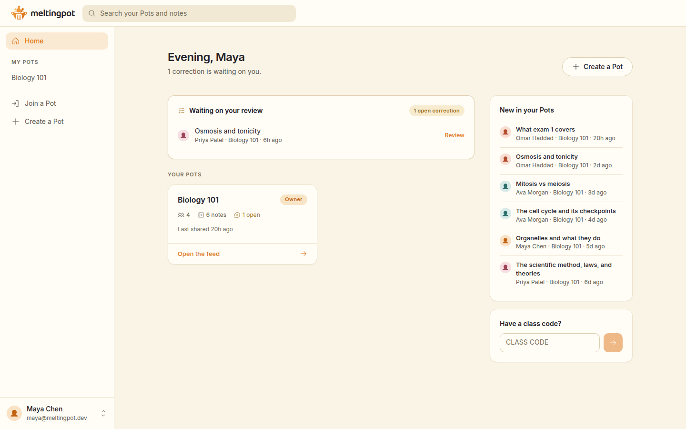
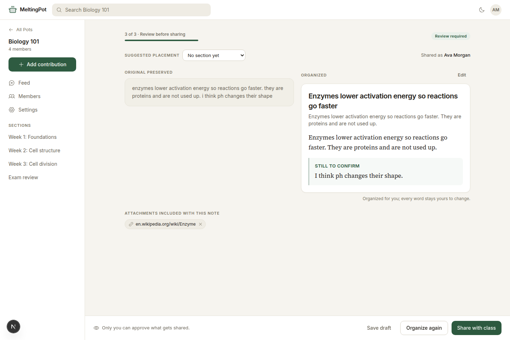
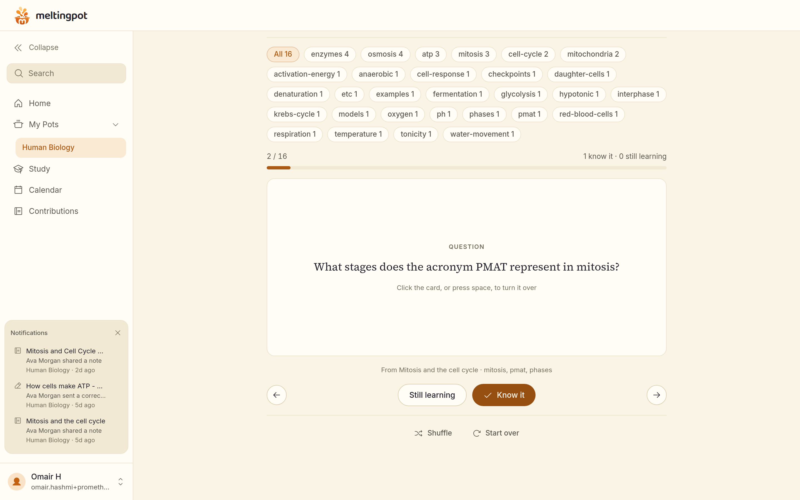
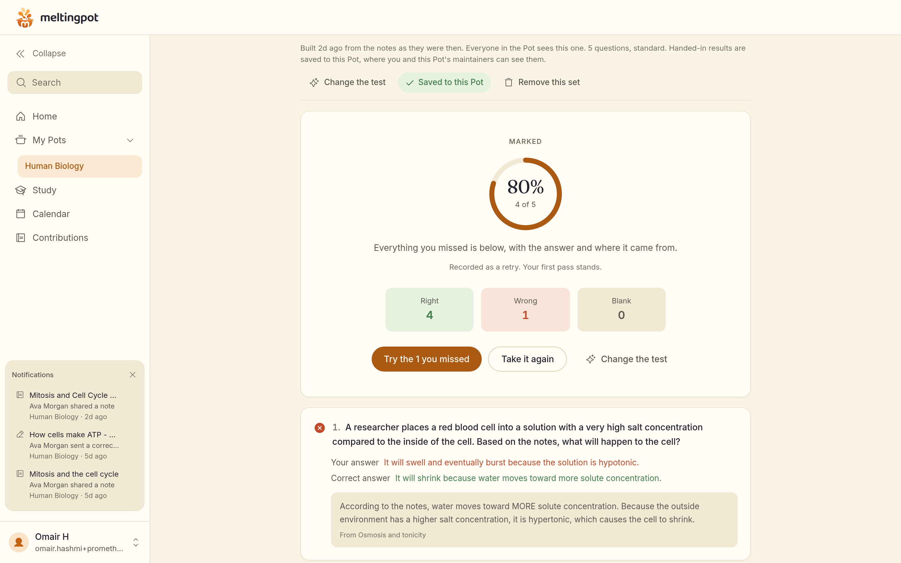
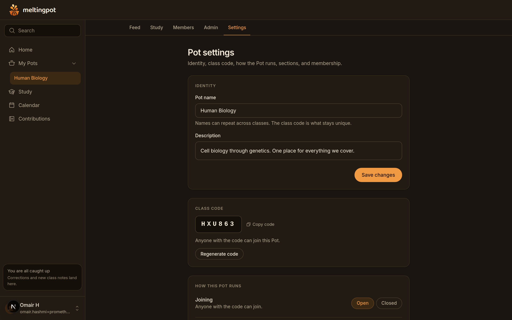
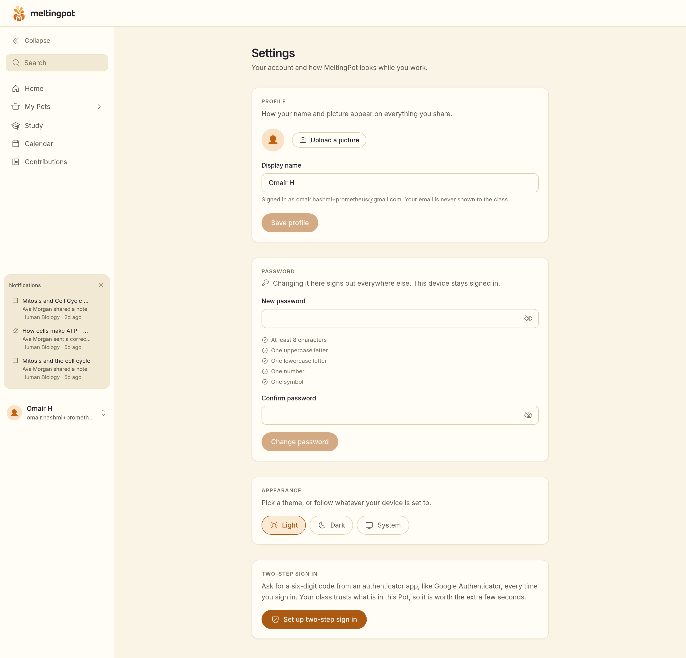

# MeltingPot

Everything your class knows, in one Pot.

**Live:** https://meltingpot-io.netlify.app

## The problem

Every class generates knowledge constantly, and almost all of it evaporates. One student writes brilliant notes nobody else sees. Another understands Tuesday's lecture but not Thursday's. The group chat has the answer somewhere, forty scrolls up. The tools that promise to fix this all fail the same way: they demand structure up front, and tired students between classes will not fill in templates.

MeltingPot starts from the opposite bet. Write anything. A student pastes rough, unformatted, half-remembered notes exactly as they come out, and MeltingPot organizes them into a clean structured note with a title, a summary, and key takeaways. The student reads the organized version next to their untouched original and decides whether to share it with the class. Nothing is ever published without a person saying so.

A class space is called a Pot. A teacher creates one and gets a six character class code; students type the code and are reading the class vault before they ever make an account. When someone spots a mistake in a shared note, they select the sentence, propose a fix, and a maintainer reviews it. Accepted corrections become a new version that credits the original author, the person who fixed it, and the reviewer. The original text of every note survives forever, one toggle away.

## Try it in two minutes

1. Open the [live site](https://meltingpot-io.netlify.app). Create a Pot as a teacher, or join one with a code if you have it.
2. Paste something messy into "Write anything". Genuinely messy: lowercase, fragments, an "i think..." you are not sure about. Watch it become a structured note, with your uncertainty kept visible as a labeled "Still to confirm" line instead of being laundered into a confident claim.
3. Share it, then open it from the feed and suggest a correction to one sentence. Review it from the maintainer side and accept it. Open the note's history to see both versions and everyone credited.

## Where the AI lives

Organization is the product, not a feature bolted onto it. Rough text is mixed into a structured note, and image attachments are captioned or transcribed when that helps. Every model call runs through authenticated server routes, treats note and attachment contents as untrusted source material, and returns schema-constrained data for normalization before the student sees it. The student's original remains untouched and nothing is shared without approval.

The Pot home is also a study hub: raw notes, a class-wide summary, flashcards, and a practice test generated from shared material. A fast model handles organization, vision, summaries, and cards; a stronger one is reserved for writing practice tests. Both are named in configuration rather than in source. The deterministic organizer remains as a local fallback when neither is configured.

Which engine did the work is always on screen. A note organized by the model says so and names it; a note the rule-based fallback had to finish says that instead, in plain words. The two produce visibly different writing and a reader cannot tell them apart from the output alone, so the app does not make them guess.

Generated material is stored per Pot and keyed by a fingerprint of the notes it was built from, so a class shares one deck rather than each student spending a generation on the same thing. Share a note, accept a correction, or remove one, and the fingerprint changes and the next request rebuilds. Nothing generated is ever put in an HTTP cache: the database is the only cache, and it is one a maintainer can look at and delete.

## Studying from what the class built

Flashcards and the practice test are learning flows, not lists. Cards come one at a time, flip on a click or the space bar, move with the arrow keys, and get marked known or still learning; the round ends on a summary that offers the hard ones again. Cards carry tags, and the deck filters by them.

A practice test is set up before it is written: five to twenty questions, three difficulties, the sections to draw from, and anything to concentrate on in your own words. It asks one question at a time with a navigator and answers you can change, reveals nothing until you hand it in, then marks with the correct answer, your answer, the explanation, and the note each question came from, and offers the ones you missed again. Nothing about how you are doing is written down anywhere.

Reading a note is study too. Notes highlight the terms they define or emphasise, worked out from the note itself rather than asked of a model, and selecting any passage offers to turn it into a flashcard that belongs to whoever wrote it.

## For the person teaching

Everything above is built for the student. One screen is built for whoever runs the Pot.

Open the Study tab in a Pot's admin page and it reads the questions the class has actually answered, grouped by the note each question came from, and tells you what to revisit and what to do about it. Two to four topics, worst first, each with one concrete thing to try in a lesson.

The split is the point. The counts are a plain database aggregate over recorded answers, so the model never touches a number and cannot get one wrong; its whole job is reading a table it was handed. The counts are printed underneath the reading, and the model is named, so a teacher can check the claim instead of trusting it.

It refuses a few things on purpose. No student is named, counted, or compared: this is about the material, not the people, and there is no ranking anywhere in it. It says nothing at all until at least twenty first-pass answers from two people exist, because one person having a bad afternoon must never reach a teacher as a fact about their class. Retries do not count, so a class that goes back over a topic never looks worse than one that never returns. And unlike every other model call here, it has no rule-based fallback: a made-up interpretation of real results is the one thing this must never produce, so when the model is unreachable the counts stand alone and the page says why.

## What is in the product

The dashboard is role aware. Students land on their own unfinished drafts and any corrections that came back asking for revision. Maintainers land on the queue of corrections waiting for their review across every Pot they maintain. Pot cards carry live member, note, and correction counts and a continue link back to the last note you read.

Search reaches notes, sections, study summaries, and flashcards across every Pot you belong to, filtered by kind and by Pot and ordered by recency or by how many times a note has been corrected.

Maintainers can take a note out of a Pot with a reason and put it back, delete a generated set, and delete cards. Removal is not deletion: the note leaves the feed, search, and study material, its page says who removed it and why, and every version and everyone credited stays on the record. Pot settings lists what is out with a way back. Deleting or archiving the Pot itself stays with the owner.

Inside a Pot: a shared feed with section filters, full text search across titles, content, contributors, and attachments, file uploads (images including phone camera HEIC, PDFs, documents) and links that stay connected from draft through publication, version history with the complete attribution trail, and maintainer tools for sections, roles, class code regeneration, and archiving with a way back. Light and dark themes throughout, reduced motion respected, and a landing page whose scroll sequence melts a messy note into an organized one.

Account settings hold the theme (light by default, dark, or follow your device) with a one tap switch in the public header, and, for the people who run a Pot, two-step sign in with an authenticator app such as Google Authenticator. That one is enforced rather than advertised: turning it on adds a code step to every later sign in, and the test suite proves it by playing the authenticator itself.

Sign in is an email and a password, behind a provider seam in `web/lib/auth`: everything the app needs from an identity provider is described in the product's own words, so moving to a hosted provider such as Clerk is an implementation behind that interface rather than a rewrite of every page. `docs/AUTH.md` explains the contract and what a swap actually costs.

## Screenshots

Role based dashboard with the maintainer review queue, Pot stats, and cross Pot activity:



Review before sharing: the organized note beside the preserved original, with attachments and identity in view:



Flashcards, one card at a time, with the deck filtered by tag:



A practice test marked, with the answer, the explanation, and the note each question came from:



Pot settings with maintainer section management, in the dark theme:



Account settings: theme, and two-step sign in for the person who runs the Pot:



## How this was built

Everything here was designed and written from scratch, starting 17 August 2026. The repo is its own receipt: `docs/PLAN.md` holds the step by step execution plan with per step status, `docs/BUILDLOG.md` records what was built, found, and fixed in order, and `memory/` captures each architectural decision and hard won lesson at the moment it happened. The commit history walks through the whole build, day by day.

Entered in the [Prometheus August AI Challenge](https://august-ai-challenge-31059.devpost.com/). The project is open source under the MIT license (see `LICENSE`), hosted live at the URL above, and the two minute demo video is on the Devpost submission.

## Under the hood

Next.js 16 (App Router, TypeScript, Tailwind) in `web/`, on Supabase for Postgres, auth, and file storage, hosted on Netlify. Security is enforced in the database, not the client: row level security on every table, privileged transitions through security definer functions that re-validate the caller at time of use, database enforced rate limiting on every sensitive operation (sized so an entire class behind one school network can sign up together), and an API surface closed down to exactly what the app uses. Anonymous visitors can reach two functions: look up a class code and register. Shared notes and their versions can only be written through the reviewed publish paths.

The build is covered by 186 unit tests and 53 Playwright end to end tests over every core flow, plus two adversarial review passes whose confirmed findings, from access control holes to a diff that could hang a browser tab, were all fixed and are documented in the build log. Both study sessions are written as reducers, so how a deck is walked and how a test is marked are unit tests rather than browser tests. A Checks workflow runs lint, types, unit tests, and a production build on every push and pull request.

## Running it locally

```bash
cd web
pnpm install
cp .env.example .env.local   # add Supabase values and a server-only model key
pnpm dev
```

Apply every migration in `supabase/migrations/` in filename order. For a development database with sample data, run `select public.dev_seed();` as the service role. Migration 0034 revoked `dev_reseed` from ordinary signed-in users, because it guarded itself on an email suffix anyone could register, so seeding is a deliberate service-role action now rather than something the app can trigger. 0013 is the production data cleanup and is only for a database going live, and it drops the seed functions, so a development database should stop before it.

Tests: `pnpm test:unit` (vitest) and `pnpm test:e2e` (Playwright, expects the dev seed).

## Configuring the model

The AI runs on Google's Gemini API. To use your own key, grab one from
[Google AI Studio](https://aistudio.google.com/apikey) and drop these three
lines into `web/.env.local`:

```bash
MODEL_API_KEY=your-gemini-api-key-here
FAST_MODEL=gemini-3.6-flash
REASONING_MODEL=gemini-3.1-pro-preview
```

Those are the two models the live site runs on, so they are a safe place to
start. Restart `pnpm dev` afterwards, since Next only reads the environment when
it boots.

**All three or none.** `mixingConfigured()` in `lib/mix/server.ts` wants the key
and both model names together. If any one of them is blank, the app quietly
falls back to its deterministic organizer and the study tools say mixing is
unavailable. That fallback is on purpose, so a model outage never stops a class
sharing their notes. The catch is that a typo in one variable looks exactly like
the AI not being set up at all, so check all three before hunting for a bug.

**What each model does.**

| Variable | What it drives | Why that tier |
| --- | --- | --- |
| `FAST_MODEL` | organizing a note, reading image attachments, class summaries, flashcards | nearly every call goes here, so it wants something fast and cheap |
| `REASONING_MODEL` | writing practice tests | question quality and the answer keys are where a stronger model earns its keep |

The code never hardcodes a model name, because provider identifiers change on
their own schedule. The two above were current when this was written, so if
Google retires one, just set whatever replaces it.

**This client only speaks Gemini.** The variable names look provider-neutral,
but the code is not. `lib/mix/server.ts` posts to
`generativelanguage.googleapis.com/v1beta/interactions`, sends your key as an
`x-goog-api-key` header, and pins `Api-Revision: 2026-05-20`. Swapping in
another provider means writing an adapter, not just changing the key.

**Cost and privacy.** The Google AI Studio free tier is enough to try every flow
in the app. Every request sets `store: false`, so your prompts stay out of the
provider's stored-content path. Calls share a deadline that sits under the
hosting platform's function ceiling, and they retry up to four times when the
provider is busy.

**Deploying it.** On Netlify, go to Site configuration, then Environment
variables. Add the key to every context you plan to use, and mark it secret. If
you set it only on `production`, deploy previews and branch deploys fall back to
the deterministic organizer without saying why, which makes for a confusing
demo. The key is only ever read on the server and never reaches the browser.

## Repo map

- `docs/SPEC.md`: the authoritative product spec
- `docs/PLAN.md`: the execution plan with per step status
- `docs/BUILDLOG.md`: what was built, found, and fixed, step by step
- `docs/AUTH.md`: the authentication seam and how to swap the provider
- `memory/`: decisions and lessons recorded as they happened
- `supabase/migrations/`: the full schema, security, and function history
- `web/`: the app

## License

MIT. See `LICENSE`.
